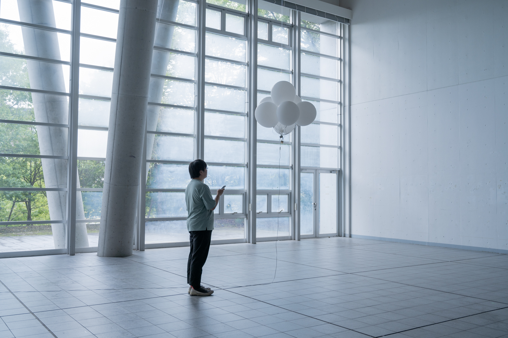
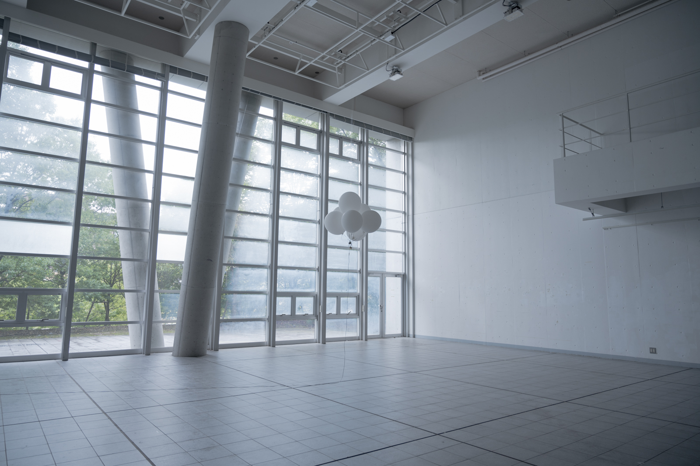
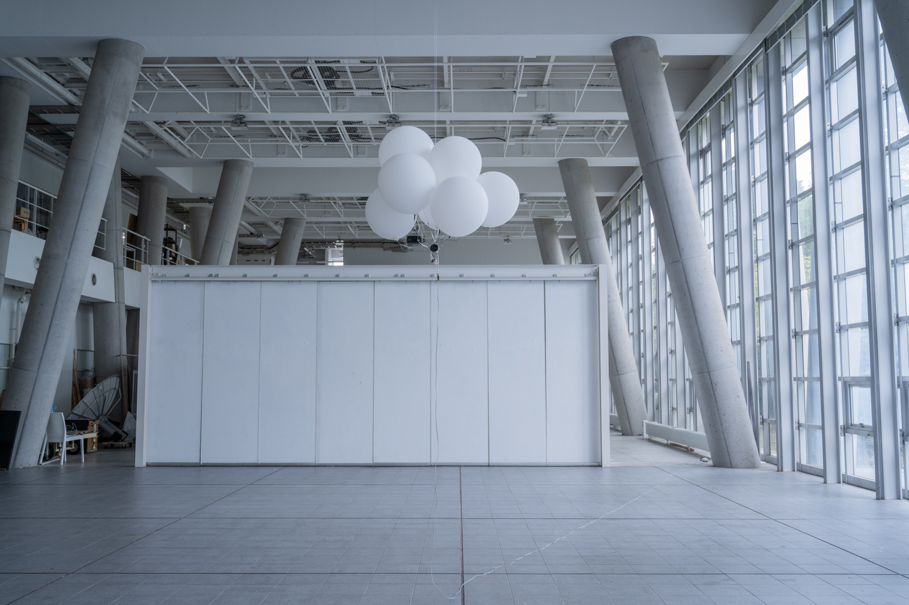
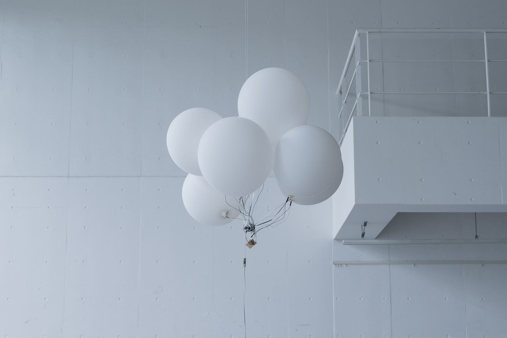
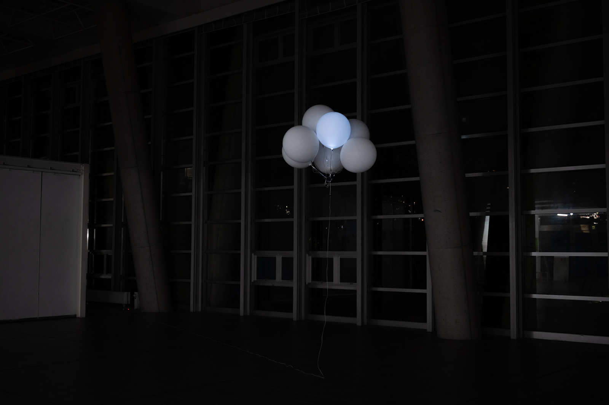
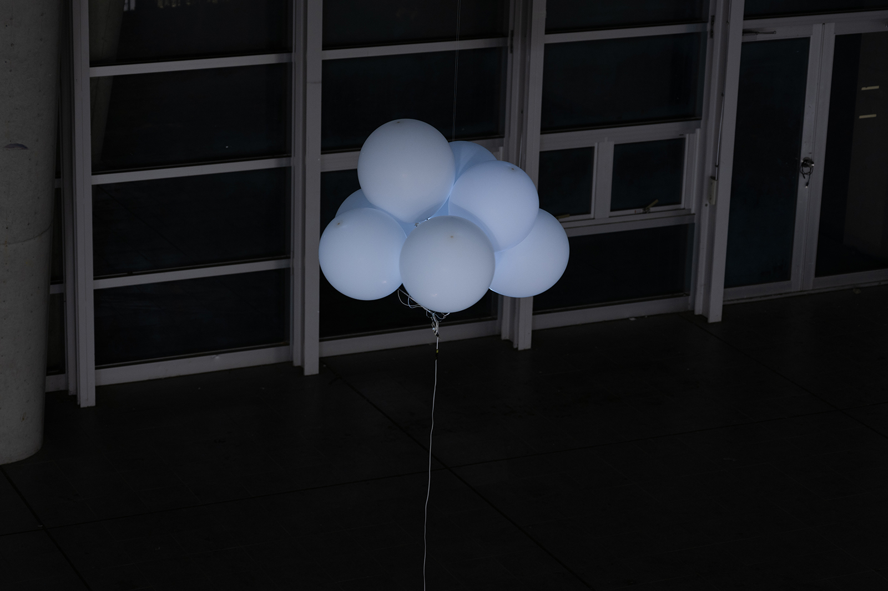
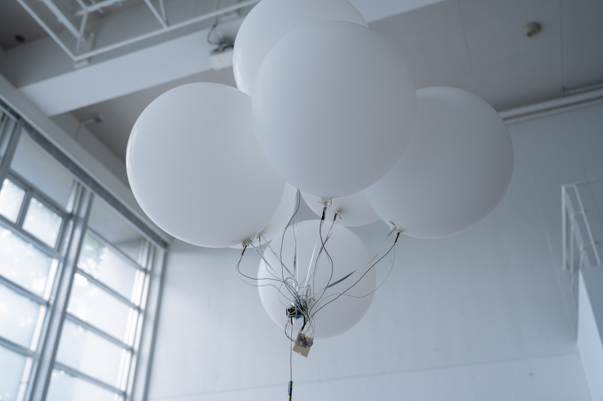
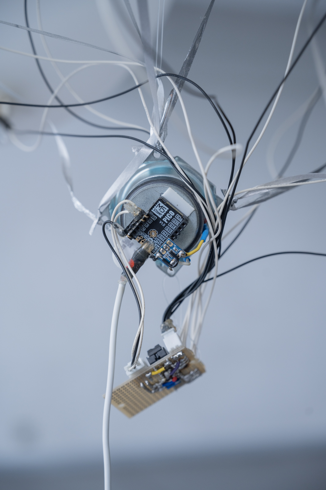

# 白い雲、黒い箱

## outline
2022年  
ヘリウムガスの入った風船、M5stamp pico、スピーカー、LED、ATMEGA328P、ウェブサイト

## text
この作品は「クラウド」を探す作品である。

まず鑑賞者は任意の場所でこの作品に付属するウェブサイト (http://159.28.100.68/) のURLを受け取る。ウェブサイトはグローバルIPアドレスを持っているこの作品から配信され、そこにはクラウドコンピューティングにまつわる詩やサーバーサイドエンジニアによる手記や雲の絵、また、このウェブサイトの配信元にあたる「クラウド」の座標や地図が掲載されている。

鑑賞者が自分のスマートフォンなどでウェブサイトにアクセスすると、「クラウド」が、音、光、そしてウェブサイトによって居場所を知らせる。それらを手がかりに鑑賞者はこのクラウドを探しに行くという作品である。

サーバーやクラウドは様々な点において隠された存在である。

まず、場所が隠されている。クラウドコンピューティングにおいてそのネットワークの規模は大きく、また、クラウドを構成するサーバーと呼ばれるコンピューターは頑丈な建物の中に隠されている。建物の場所を、都内の複数路線最寄り駅から徒歩何分といったような曖昧な表現で表されるようなデータセンターもある。多くの場合、複数の場所にあるコンピューター同士が連動しており、端末が受信するあるいは端末から送信したデータがどこを行き来しているかは一概に定まらない。クラウドというその仕組みが物理的な計算を行なっている場所をさらに曖昧にしている。

そして、コード（プログラム）が隠されている。私はサーバーサイドエンジニアとして働いている。システムの仕組み上、コードは全てサーバーの中で実行され、つまり、それは私がどのようなコードを書いて、どのようなことがサーバーで起きているかは私しかわからないということである。これは送信された個人情報を含むデータをどのように操作・保存・管理・削除するかは私の一意で決められるという経験だった。

私はサーバーサイドエンジニアとしてサーバーを「雲」によって隠すことに加担しているという後ろめたさと、どうしようもできない歯痒さを味わった。

私はその経験から、ヘリウムの入った複数の風船をクラウドのメタファーとして使用し、その場所で目に見え、「白くて、浮かんでて、フワフワしてて、雲の真似をする」1台の小さなウェブサーバーを制作した。この作品は、日常的に知らない間に知らない場所へ送信され、どのように処理されるかわからないデータについて、送信するデータの選択への意識が抜けている可能性への警鐘と、その冷静な選択を促すためにクラウドへの意識を向けるための作品である。

必ずしも全ての送信を遮断する必要はない、というより全ての送信を遮断することはもうできない。必要なのは送信されてしまうデータの冷静な選択なのではないだろうか。